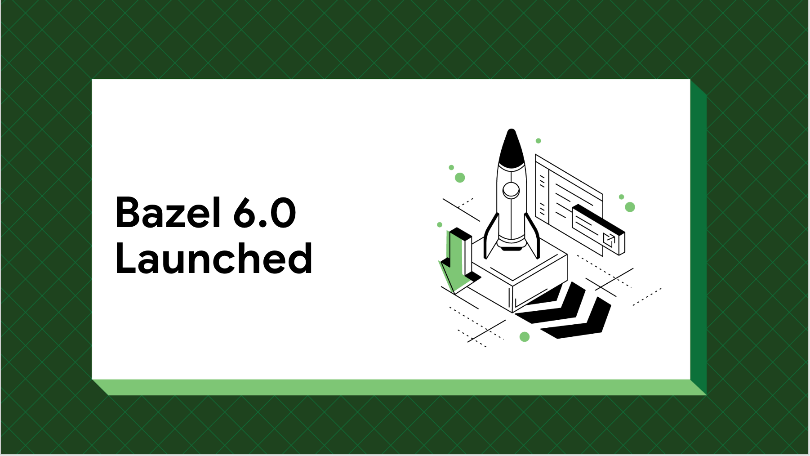

# Bazel 6.0 is now available!
Bazel 6.0 is now available for use in your build pipeline. Bazel 6.0 is the Long Term Support release available in 2022. With Bazel 6.0, we have delivered highly requested customer updates that will simplify Bazel usage and eliminate some Android app development roadblocks users have run into in 2022.

## Android app builds with Bazel
This release improves building Android apps with Bazel. It now uses [D8](https://developer.android.com/studio/command-line/d8) for dexing and desugaring by default, which was a high priority customer request. With D8, our customers can leverage the latest Android tooling for building mobile apps. 
Through [community contributions,](https://github.com/bazelbuild/bazel/pulls?q=is%3Apr+is%3Aclosed+label%3Ateam-android+closed%3A2021-11-01..2022-12-02+) Bazel Android builds now also support a variety of quality-of-life and efficiency improvements, such as persistent workers for resource processing and (optional) manifest permission merging.

- Bzlmod is now Generally Available.During BazelCon 2021, we announced the development of Bzlmod which will allow Bazel users to manage dependencies easily with automatic version resolution.
- [Bzlmod](https://bazel.build/docs/bzlmod) automatically resolves transitive dependencies, allowing projects to scale while staying fast and resource-efficient. Bzlmod is generally available with Bazel 6.0.
-   Common dependencies and rulesets are checked into Bazel Central Registry.
-   [Bzlmod Migration Guide](https://docs.google.com/document/d/1JtXIVnXyFZ4bmbiBCr5gsTH4-opZAFf5DMMb-54kES0/edit?usp=gmail) has been refreshed and provides scripts and documentation for migration. 
-   Bzlmod includes support for rules_jvm_external, allowing users to download Maven dependencies for Java projects.

## Optional toolchains
Our Developer Satisfaction survey indicated that rule authors want support for improved [toolchain development](https://bazel.build/versions/6.0.0/extending/toolchains#optional-toolchains). Bazel 6.0 allows authors to write rules using an [optional, high performance toolchain](https://bazel.build/docs/toolchains#optional-toolchains)s when available, with a fallback implementation for other platforms.

## Improve Build Productivity with these additions to build performance profiles
With Bazel 6.0, builds provide more system and CPU related metrics data so that you can [optimize for build productivity.](https://blog.bazel.build/2022/11/15/build-performance-metrics.html)

-   system load average (`--experimental_collect_load_average_in_profiler`)   
-   worker memory usage (`--experimental_collect_worker_data_in_profiler`)
-   system network usage (`--experimental_collect_system_network_usage`)

## Control .bzl dependencies with load visibility
Starting in Bazel 6.0, rule and macro authors can declare a [load visibility](https://bazel.build/versions/6.0.0/concepts/visibility#load-visibility) for their .bzl files by calling the new `[visibility()](https://bazel.build/versions/6.0.0/rules/lib/globals#visibility)` built-in. This restricts what parts of the workspace may `load()` the .bzl file, so that macros and rules do not automatically become de facto public APIs.

[Release notes for Bazel 6.0](https://docs.google.com/document/d/1pu2ARPweOCTxPsRR8snoDtkC9R51XWRyBXeiC6Ql5so/edit#heading=h.kh1neevharzp)
